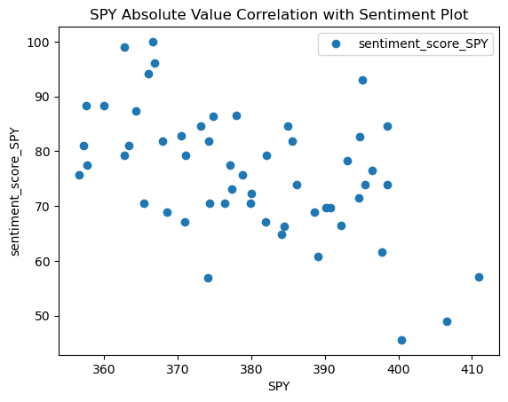
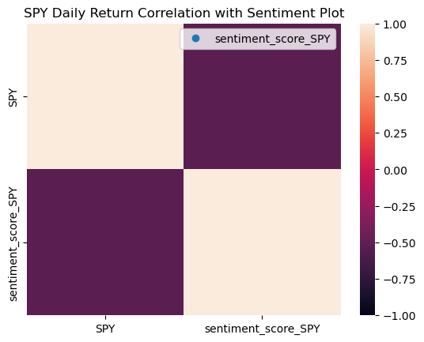
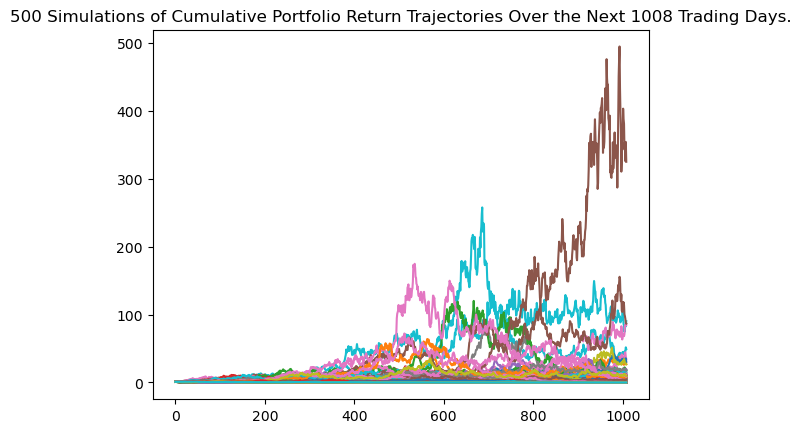

# Asset Correlation Analysis

## User Story

## Table of Contents

1. [Project Links](#Project-Links)
1. [Questions](#Questions)
1. [Instructions](#Instructions)
1. [Project Team](#Project-Team)
1. [Contribution Guidelines](#Contribution-Guidelines)
1. [Contanct](#Contact)
1. [License](#License)

## Project Links

[Repo Link](https://github.com/robel-codes/asset-correlation-analysis) <br>


## Questions

- What tools can be used to diversify your portifolio?

- Is there a measurable correlation between the weather in NYC and the performance of the market?


- Which of the factors in our initial data set is most correlated with the S&P 500?


- Could look at non traditional factors like weather?

- Does a relationship exist between the overall market performance and the sentiment of people's Google searches?



- Would a portfolio made up of SP500 index fund, BTC and Oil perform well over time?




## Instructions

Add a .env file and add this code with your Alpaca credintals to make an API call via Alpaca SDK

```
 * ALPACA_API_KEY = "your-alpaca-api-key"
 * ALPACA_SECRET_KEY='your-alpaca-secret-key'
```

## Project Team

[Ben Eilers](https://github.com/bweilers) <br>
[Eyob](https://github.com/dobinhom) <br>
[Robel Gebremeskel](https://github.com/robel-codes) <br>

## Contribution Guidelines:

```
Feel free to contribute to this repo by creating issues or sending an email to any of the contributors in the list below.
```

## Contact

<details>
    <summary>Contact</summary>
    ben.eilers@gmail.com <br>
    dobinhom@gmail.com <br>
    rofikre@yahoo.com <br>

</details>

## License

#### Distributed under the MIT License. See [Choose A License](https://choosealicense.com/) for more details.
